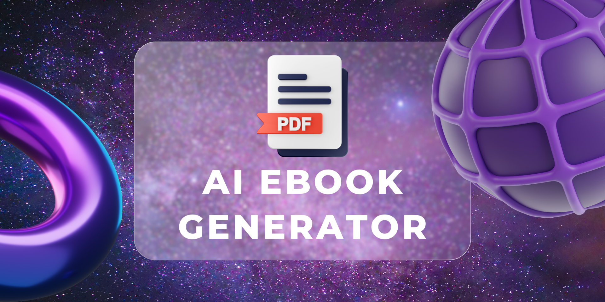

# AI eBook Generator



## Overview

  

This project generates an eBook based on user input using the Cohere AI model. The eBook content is formatted in Markdown, converted to HTML using a selected template, and then rendered as a PDF. The workflow includes generating content, converting it to HTML, embedding it in a chosen template, and converting the final HTML to a styled PDF.

  

## Requirements

  

- Python 3.x

-  `cohere` Python package

-  `pdfkit` Python package

-  `markdown` Python package

-  `wkhtmltopdf` installed on your system

  

## Platforms

  

AI Ebook Generator is compatible with the following platforms:

  

- Windows

- Mac

- Linux

  

## Prerequisites

  

Before running the app, ensure that you have Python installed on your system along with the necessary dependencies:

  

- Python 3.x

  
  

## Installation

  

1.  **Install Python Packages**:

Ensure you have the required Python packages installed:

  

```bash
pip install -r requirements.txt
```

  

2.  **Install wkhtmltopdf**:

  
  

-  **For Windows**: Download and install from [wkhtmltopdf.org](https://wkhtmltopdf.org/downloads.html) and make sure it's added to your system's PATH. Use the provided `add_wkhtmltopdf-to-path.bat` script to set up the PATH variable.

-  **For macOS**: Use Homebrew: `brew install wkhtmltopdf`.

-  **For Linux**: Use your package manager, e.g., `sudo apt-get install wkhtmltopdf`.

  

**`add_wkhtmltopdf-to-path.bat` Script**:

  

If you are using Windows, run the `add_wkhtmltopdf-to-path.bat` script to automatically add `wkhtmltopdf` to your PATH. You can find this script in the project directory.

  

Make sure to adjust the path in the script to match where `wkhtmltopdf` is installed on your system.

1.  **Prepare Configuration**:

Create a file named `config.py` and replace `your-cohere-api-key` with your actual [Cohere](https://cohere.com/) API key:

```python
# config.py
COHERE_API_KEY = 'your-cohere-api-key'
```

## Usage

1.  **Templates**:

HTML templates are present in the `templates` folder:


-  `classic.html`

-  `modern.html`

-  `minimalist.html`

-  `elegant.html`

-  `dark.html`


These are the default templates that comes with this app. but you can make your own template too.

Each template should have the following structure, with `{{MARKDOWN_CONTENT}}` as a placeholder for the eBook content:

  

```html
<!DOCTYPE html>
<html lang="en">
<head>
    <meta charset="UTF-8">
    <meta name="viewport" content="width=device-width, initial-scale=1.0">
    <title>eBook - Classic</title>
    <style>
        body {
            font-family: 'Times New Roman', serif;
            line-height: 1.8;
            margin: 0;
            padding: 30px;
            background-color: #f5f5f5;
        }
        h1, h2, h3, h4, h5, h6 {
            color: #333;
        }
        p {
            margin: 15px 0;
        }
        code {
            background-color: #f4f4f4;
            padding: 4px 6px;
            border-radius: 4px;
        }
        pre {
            background-color: #f4f4f4;
            padding: 12px;
            border-radius: 4px;
            overflow-x: auto;
        }
    </style>
</head>
<body>
    <markdown>
        {{MARKDOWN_CONTENT}}
    </markdown>
    <script src="https://cdn.jsdelivr.net/npm/showdown/dist/showdown.min.js"></script>
</body>
</html>


```

  

1.  **Run the Script**:

  

### Execute the `main.py` script:

  

```bash
python main.py
```

  

### Follow the prompts to:

- Enter the eBook topic.

- Specify the number of chapters.

- Choose a template from the provided options.

  

###  The script will:

- Generate the eBook content.

- Convert the content to HTML.

- Embed the HTML content into the selected template.

- Convert the final HTML to a PDF.

  

## Example

Running the script:

```bash
python  main.py
```

-  **Enter the eBook topic**: "The Future of AI"

-  **Enter the number of chapters**: 5

-  **Choose a template (1-5)**: 2 (Modern)

  

The script will produce `ebook.pdf` with the generated content styled according to the chosen template.

  

## Files

-  `add_wkhtmltopdf-to-path.bat`: A batch script to add `wkhtmltopdf` to the system `PATH` on Windows.
- `config.py`: Contains the API Key.
- `main.py`: The Main Program
- `requirements.txt`: The Project Requirements.
- `templates/`: this folder contains all default templates 


## Project Structure

  
```
eBook-Generator/
	├── main.py
	├── config.py
	├── requirements.txt
	├── add_wkhtmltopdf-to-path.bat
	├── templates/
	│ ├── classic.html
	│ ├── modern.html
	│ ├── minimalist.html
	│ ├── elegant.html
	│ ├── dark.html

```

By following this guide, you should be able to generate an eBook in PDF format using different templates provided in the `templates` folder.

## Contribution

We welcome contributions to enhance this project! Please refer to our [Contributing Guidelines](CONTRIBUTING.md) for detailed instructions on how to contribute.

## Code of Conduct

We expect all contributors to adhere to our [Code of Conduct](CODE_OF_CONDUCT.md). Instances of abusive, harassing, or otherwise unacceptable behavior may be reported to the community leaders responsible for enforcement at [your-email@example.com]. All complaints will be reviewed and investigated promptly and fairly.